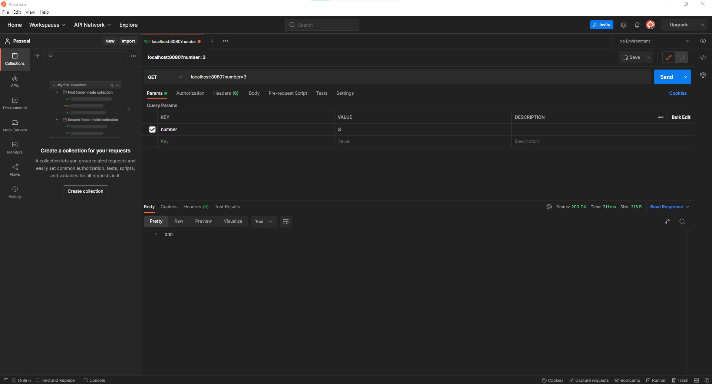
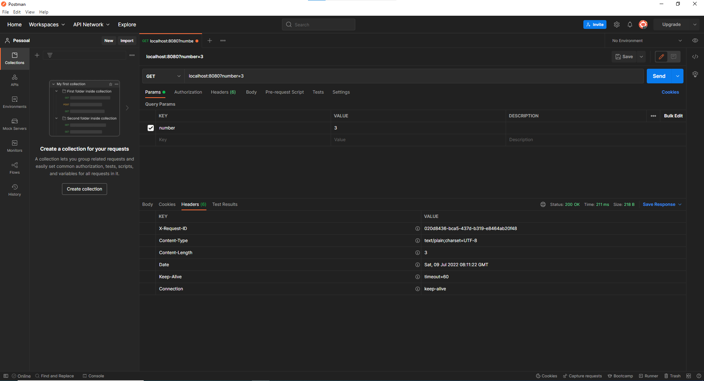
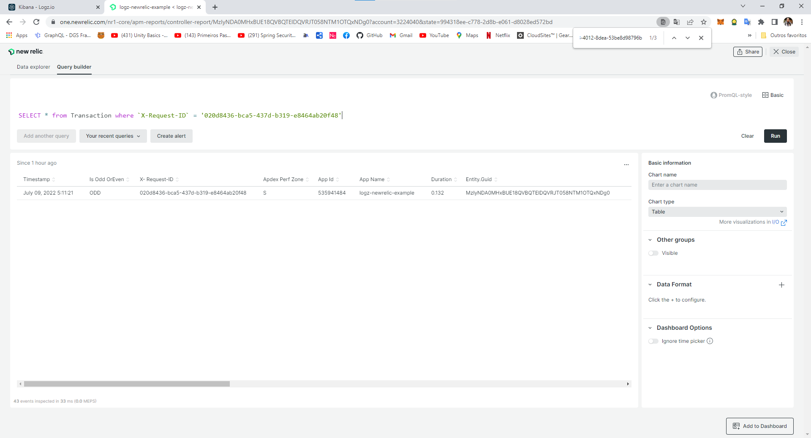
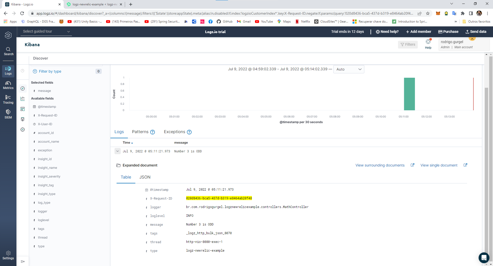

# Logz.io and New Relic Example
Tracing logs and correlation with application performance monitoring
### Request and Response Body:

### Response Header with X-Request-ID:

### New Relic Transaction With Custom Parameter X-Request-ID

### Logz.io With X-Request-ID:

### Run with New Relic
run gradle tasks:
```
downloadNewrelic
unzipNewrelic
```

add Environment Variables:
```
NEW_RELIC_LICENSE_KEY
NEW_RELIC_APP_NAME
```

add VM Options:
```
-javaagent:newrelic\newrelic.jar
```
### Run with Logz.io
add Environment Variable:
```
LOGZ_IO_TOKEN
```

